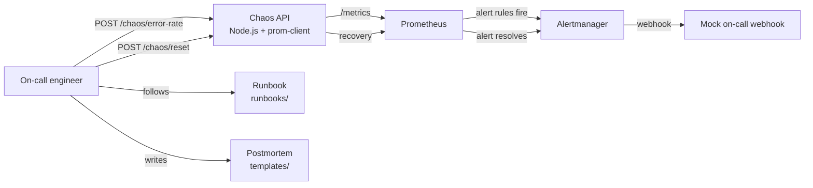
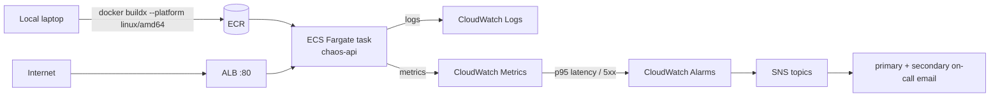

# chaos-testing

[](https://github.com/bubakry/chaos-testing/actions/workflows/ci.yml)
[](LICENSE)
[](https://www.terraform.io/)
[](https://aws.amazon.com/fargate/)
[](https://prometheus.io/)
[](https://nodejs.org/)

> A self-contained incident response and reliability **game-day kit**: a Node.js
> service that injects controllable failures, a local Prometheus + Alertmanager
> stack, AWS Fargate IaC for realistic cloud exercises, and the runbooks /
> postmortem templates an on-call would actually use.
>
> Drop in, break the service on purpose, follow the runbook, validate recovery,
> and write the postmortem — all in one repo.

## Why this exists

Most "deploy a service" projects stop at green health checks. Real reliability
work begins **after** the service is healthy: alarms have to fire, dashboards
have to be readable, runbooks have to be followed, and on-call has to know
what to do. This repo gives you a deliberately fragile API plus the operational
scaffolding to practice that loop end to end.

## Highlights

- **Failure-injection API** — error-rate, latency, dependency outage, memory
  pressure, and CPU saturation can all be turned on with a single `POST`.
- **Two ways to run it** — local stack via `docker compose` for fast demos,
  or AWS ECS Fargate + ALB + CloudWatch alarms + SNS for realistic exercises.
- **Account-guardrail Terraform** — set `EXPECTED_ACCOUNT_ID` and the apply
  fails if you're authenticated to the wrong AWS account.
- **Operational artifacts, not just code** — runbooks, on-call workflow,
  alert→playbook map, postmortem template, handoff template, comms template.
- **End-to-end automation** — `aws_full_automation.sh` deploys, generates
  baseline traffic, injects an error storm, checks alarms, recovers, and
  optionally tears the stack down.
- **Prometheus instrumentation** — `prom-client` metrics for request count,
  error count, and latency histograms; alert rules + Alertmanager routing
  ship in the repo.

## Game-day loop



## AWS reference architecture



## Quickstart

### Local mode

```bash
docker compose up --build

# In another terminal:
curl -s http://localhost:8080/healthz
curl -s http://localhost:8080/chaos/state

# Run the baseline scenario
BASE_URL=http://localhost:8080 ./scripts/chaos_scenarios.sh baseline
```

Prometheus is at `http://localhost:9090`, Alertmanager at `http://localhost:9093`.

### AWS mode

```bash
export AWS_REGION=us-east-1
export PROJECT_NAME=chaos-game-day
export ENVIRONMENT=demo
export EXPECTED_ACCOUNT_ID=$(aws sts get-caller-identity --query Account --output text)

./scripts/deploy_to_aws.sh         # builds, pushes ECR, applies Terraform
./scripts/aws_full_automation.sh    # full game-day workflow
./scripts/destroy_aws_stack.sh      # tear it back down
```

A CloudShell-friendly variant (`scripts/cloudshell_full_automation.sh`) skips
the local Docker build and pulls the image from an existing ECR repo.

See [AWS_TEST_NOTES.md](AWS_TEST_NOTES.md) for a manual validation checklist
and common failure cases.

## Chaos endpoints

| Method | Path | Effect |
| --- | --- | --- |
| `POST` | `/chaos/error-rate` | Inject random 5xx at the given percent |
| `POST` | `/chaos/latency` | Add fixed latency in milliseconds |
| `POST` | `/chaos/dependency` | Simulate a downstream dependency outage |
| `POST` | `/chaos/memory` | Retain memory chunks to drive RSS up |
| `POST` | `/chaos/cpu` | Spin a CPU-busy loop |
| `POST` | `/chaos/reset` | Clear all chaos state |
| `GET` | `/chaos/state` | Inspect the current chaos configuration |
| `GET` | `/healthz` | Liveness |
| `GET` | `/readyz` | Readiness |
| `GET` | `/api/orders` · `/api/payments` · `/api/notifications` | Sample business endpoints |
| `GET` | `/metrics` | Prometheus exposition |

## Repository structure

```text
chaos-testing/
├── app/                # Node.js chaos API + Dockerfile
├── aws/                # Terraform: ECR, ECS Fargate, ALB, CW alarms, SNS
├── scripts/            # Shell automation: deploy, run scenarios, alarm checks
├── prometheus/         # prometheus.yml + alert-rules.yml
├── alertmanager/       # alertmanager.yml routing
├── runbooks/           # on-call workflow, alert→playbook map, game-day checklist
├── templates/          # postmortem, handoff, incident comms templates
├── docker-compose.yml  # local stack
└── AWS_TEST_NOTES.md   # manual validation playbook
```

## Operational artifacts

- [`runbooks/on-call-workflow.md`](runbooks/on-call-workflow.md) — what an
  on-call engineer should do when paged.
- [`runbooks/alert-playbook-map.md`](runbooks/alert-playbook-map.md) — alert
  → response runbook lookup.
- [`runbooks/game-day-checklist.md`](runbooks/game-day-checklist.md) —
  pre/during/post checklist for a scheduled exercise.
- [`templates/postmortem-template.md`](templates/postmortem-template.md) —
  blameless postmortem skeleton.
- [`templates/oncall-handoff-template.md`](templates/oncall-handoff-template.md)
  — shift change handoff.
- [`templates/incident-communications-template.md`](templates/incident-communications-template.md)
  — internal/external comms during an active incident.

## Tech stack

- **App** — Node.js 20, Express, prom-client
- **Local stack** — Docker, Docker Compose, Prometheus, Alertmanager
- **Cloud** — AWS ECR, ECS Fargate, Application Load Balancer, CloudWatch
  Alarms, SNS
- **IaC** — Terraform 1.9
- **Automation** — Bash, AWS CLI v2

## What I built this for

I wanted to practice the full operational loop, not just deployment. The goal
was a compact project where I can deploy a service, inject failures, validate
alarms, follow runbooks, and document recovery as if it were a real incident —
on either a laptop or a real AWS account.

## License

[MIT](LICENSE).
